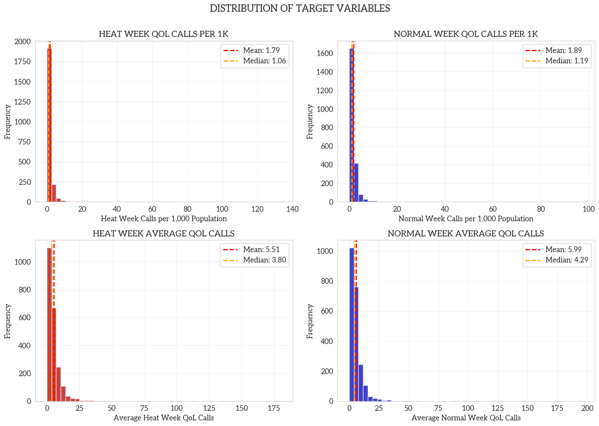
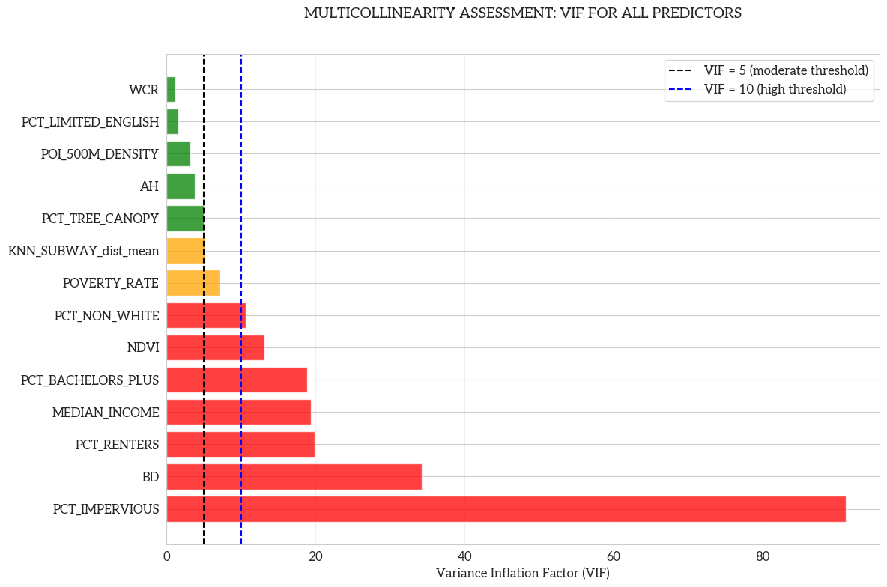
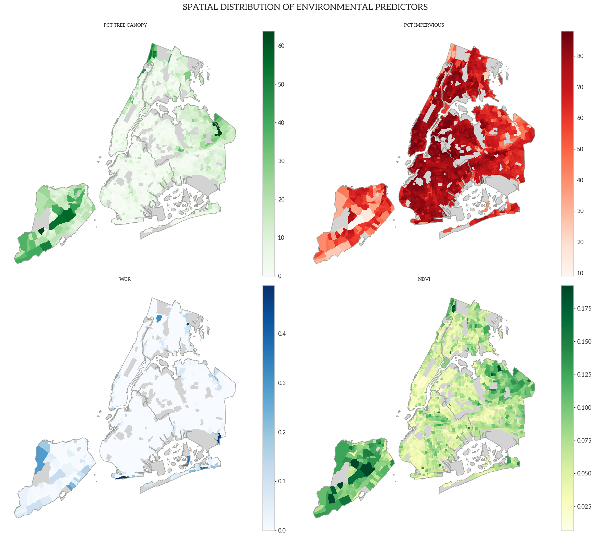
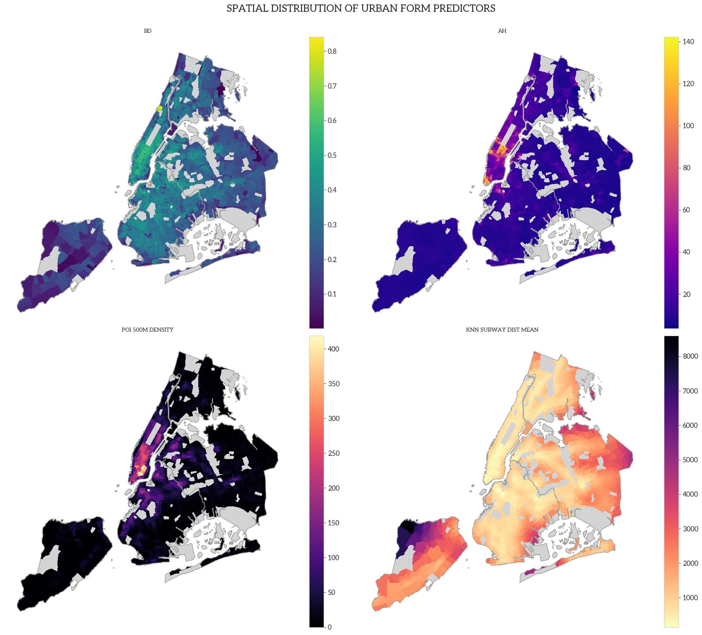

# 1. INTRODUCTION

## 1.1. Research Background

Extreme heat weather is one of the deadliest environmental hazards in the United States, the heat extreme heat events have significant negative impacts on urban public health and urban sustainable development. In dense, urban metropolitan cities like New York, extreme heat interacts with not just the built environment and local infrastructure conditions, but also the socioeconomic climate—extreme heat acts as one of the many architects shaping where service disruptions, complaints, and other surrounding stressors occur, degrading quality-of-life (QoL) for urban residents.

Within the context of this degradation is New York City’s 311 service, a complaint system that accepts reports via calls, emails, and website submissions that can reflect heat induced QoL behavior; it is a granular, real-time lens that provides understanding of how heat-related aggravation and other aspects can translate into observable, negative resident sentiment. This project in particular seeks to connect extreme heat versus normal heat weeks with environmental factors, socioeconomic conditions, and urban morphology to potentially explain QoL issues by different factors and their different performance during hotter periods.

In this regard, the project is built upon geospatial data science techniques for modeling weekly QoL outcomes in extreme heat and normal heat conditions, as proxied by selected 311 report categories, using ordinary least squares (OLS) regression modeling as a baseline followed by modern machine learning (ML) models, and SHapley Additive exPlanations (SHAP) method to interpret.

## 1.2. Research Gap

A substantial body of literature has established the correlation between rising temperatures and increased frequency of 311 service requests, specifically regarding noise, energy, and water consumption (Harlan et al., 2006; Hsu et al., 2021). And some other urban research also identified how different socioeconomic, environmental, and urban built metrics patterns shape the spatial heterogeneity of 311 calls (Uejio et al., 2010). However, fewer studies connect them and investigate how the impact of these factors on QoL performance shifts when the thermal environment crosses into extreme thresholds.

Transitional approaches like OLS in 311 analysis generally struggle to capture the non-linear behaviors of human-environment interactions. While machine learning offers improved predictive power, (Kontokosta & Tull, 2017) it generally lacks interpretability. So, by integrating SHAP approach to compare extreme versus normal heat weeks, this study addresses a critical gap, where it takes a step further from simple prediction to interpret and explain socioeconomic, environmental, and urban built drivers under two different heat regimes, of which is explained in detail in section 2. (Lundberg & Lee, 2017)

## 1.3. Research Objective

With the research gap's context, this study asks: how do environmental, socioeconomic, and urban morphology factors influence the QoL in New York City, defined as QoL-related 311 report rate per capita, during extreme heat weeks versus normal heat weeks?

Heat-related academic literature suggests that discomfort rises with temperature, so it is hypothesized that the QoL rate per capita will align with those findings. However, the objective of this research is to produce SHAP model values that can help reveal the drivers of QoL complaints in New York City.

# 2. DATA and METHODS

## 2.1. Study Area and Period

The study area is based in New York City with spatial resolution at the census tract level, with these observations during summer 2025, defined as the beginning of June through August 23rd at a weekly temporal resolution. The full month of August was not used due to recent weather data only recorded up to the 24th, therefore not providing a whole week, so it was removed from the study.

## 2.2. Data Preparation

### Heat Data

The subsequent removal of August's last week provided a total of 12 weeks in summer 2025, where extreme heat weeks were defined as at least two extreme heat days within a week with a temperature cutoff threshold at 93°F using the John F. Kennedy (JFK) weather station located at Philadelphia's international airport. This threshold was determined according to a climatological baseline from 1981 through 2010 daily max temperature with a 95th percentile, and this split the observations into two needed regimes: 17 extreme heat days and 71 normal heat days, providing 5 extreme heat weeks and 7 normal heat weeks. Data was directly downloaded from the National Oceanic and Atmospheric Administration (NOAA).

### Socioeconomic Data

Socioeconomic data was derived from the United States Census, specifically the most recent 5-year American Community Survey (ACS) in 2023. Python's `pyCensus` module provided easy access to filter the data down to main investigative, derived variables in the final table:

-   Percent Bachelor's or More (B15003_022E / B15003_001E)
    -   Bachelor's or More / Education Total
-   Percent Renters (B25003_003E / B25003_001E)
    -   Renter Count / Household Total
-   Percent Limited English Speakers (B16005_007E / B16005_001E)
    -   Limited English Speaker Count / Household Total
-   Median Household Income (B19013_001E)
-   Poverty Rate (B17001_002E / B17001_001E)
    -   Poverty Count / Total Whom Poverty Status is Recorded
-   Percent Non-White (1 - B02001_002E / B01003_001E)
    -   (1 - White Count / Total Population)

Justifications for these variables highlight socioeconomic issues and how heat-related issues disproportionately affect different communities as well as how different communities interact with public services like New York City's 311. Educated and higher-income individuals may know how to navigate what their cities offer, limited English speakers may have more barriers accessing 311 services, renters may face more infrastructural issues compared to owners,

### Urban Environmental Data

Environmental urban data were all derived from Landsat raster calculations, specifically scenes within the same study timeline, with the computation done through ArcGIS Pro. However, land-cover land-use (LULC) data was a static raster from 2024.

-   LULC Raster
    -   Percent Tree Canopy (`PCT_TREE_CANOPY`)
    -   Percent Impervious Surface (`PCT_IMPERVIOUS`)
-   Surface Temperature / Reflectance Raster
    -   Average Height of Buildings (`AH`)
    -   Building Density (`BD`)
    -   Normalized Difference Vegetation Index (`NDVI`)
    -   Water Coverage Ratio (`WCR`)

Other data included deriving spatial features from Python's `osmnx` module to calculate points-of-interest (POI) density utilizing a 500-meter buffer and mean Euclidean distance to the nearest subway of census tract centroids.

Justification for these variables are that quantifiable metrics of greenery such as tree canopy and NDVI, as well as water coverage, could help explore the relationship between their roles in heat mitigation and alleviating air pollution within cities, and how they could potentially affect QoL requests as a byproduct. In addition, the impervious surface can suggest high heat absorption throughout the city at high percentages, and this is the same case with the building heights and densities. While many of these environmental and urban forms may be multicollinear, the goal is striving for interpretation rather than maximizing prediction, and this helps to explore the different properties of a city.

POIs were determined as everyday main amenities, shops, leisure, and public transport categories in OpenStreet Maps (OSM) yielding 21,309 points, and are as follows:

-   Amenity
    -   library
    -   community_centre
    -   social_facility
    -   bus_station
    -   bar
    -   restaurant
    -   fast_food
    -   toilets
    -   hospital
    -   clinic
    -   pharmacy
-   Shop
    -   convenience
    -   supermarket
    -   alcohol
    -   deli
-   Leisure
    -   park
-   Public Transport
    -   station

### Urban Built and Spatial Data

## 2.3. OLS Regression Model

OLS regression was used as the foundational statistical model in this study because it provides an interpretable, baseline framework for understanding the linear associations between environmental, socioeconomic, urban morphology, and spatial accessibility characteristics and the dependent variable of heat-related QoL 311 complaints per capita.

Separate cross-sectional OLS models were estimated for extreme heat weeks defined as those with at least two extreme heat days, and normal heat weeks defined as those with less than two extreme heat days, with each of the 2,225 observations representing a census tract by week.

Predictors were structured into three conceptual categories, which were added incrementally to assess the added explanatory value of each predictor block: Environmental Predictors, Socioeconomic Predictors, and Urban Morphology Predictors.

**Urban Environmental Features:** NDVI, percent tree canopy, percent impervious surface, and water cover ratio.

**Urban Socioeconomic Features:** Median income, poverty rate, percent renters, percent limited English, percent bachelor’s or more, and percent non-white.

**Urban Built and Spatial Features:** Average building height, building density, distance to the nearest subway station, and 500-meter buffer POI density.

OLS provides a transparent estimation of how predictors correlate with QoL complaint rates, and coefficients can be directly interpreted and compared across extreme versus normal heat conditions, serving as an important reference model before introducing nonlinear ML approaches with Random Forest. So, given the behavioral nature of 311 complaint reporting and the noisy, high-frequency variability of QoL calls, relatively low R² values are expected in this domain, consistent with existing literature on 311 data, urban complaints, and human-environment interactions.

## 2.4. ML Model and SHAP

Stepping further to understanding the relationships between QoL and urban dynamics under different heat conditions, to complement the OLS framework, a nonlinear ML model was used to test whether environmental, socioeconomic, and urban predictors collectively produce stronger predictive power for QoL rates per capita during extreme and normal heat weeks.

In the case of this study RF, is stable on moderate-size datasets and can handle high multicollinearity and correlated predictors like this study's without requiring regularization. In addition, it is less sensitive to hyperparameter tuning and is capable of modeling nonlinear relationships and threshold behaviors associated with heat stress, as it is a popular ML model used in the environmental exposure, health, and urban prediction literature.

Like the OLS model, the RF models were trained in the extreme heat weeks and normal heat weeks with the same predictor groups for direct comparison. Then, to prevent overfitting and ensure generalizability, a 3-fold cross-validation was implemented, partitioning the tracts into an 80% train set and 20% test set, with the RF hyperparameters as follows:

-   n_estimators: `[200, 400, 600]`
-   max_depth: `[10, 20, 30]`
-   min_samples_split: `[2, 5, 10]`
-   max_samples_leaf: `[1, 2, 4]`
-   max_features: `["auto", "sqrt", 0.5]`

While OLS is useful for interpretation, extreme heat effects on QoL likely possess nonlinearity, interactions between the built environment and socioeconomic vulnerability, among others, and RF accommodates to these unique idiosyncracies, capturing behavioral and nonlinear dynamics that OLS falls short on.

Finally, SHAP was used to interpret the Random Forest predictions and quantify the contribution of each predictor to the predicted QoL complaint rate per capita. This particular methodology is well-suited for urban and environmental modeling because it, like Random Forest, can handle nonlinear, interactive relationships, but it can especially decomposes predictions into additive contributions from each predictor, providing a measure of global importance and local explanations, so this makes the two regimes of extreme heat weeks versus normal heat weeks comparable.

With this, SHAP allows identification of which environmental, socioeconomic, or urban factors become more influential during extreme heat, and whether predictors behave differently under high heat versus normal heat conditions.

# 3. RESULTS

## 3.1. Exploratory Data Analysis

Histograms reveal leftward shift in heat week call distribution relative to normal weeks, evidenced by both mean and median decreases. This is a slight call reduction during extreme heat periods, conflicting with the main hypothesis. This may likely be due to behavioral shifts during extremes versus normals. While the 311 calls were selected based on their connections to heat and heightened aggravation with high temperatures, certain complaints like "banging" or "loud music" *could* decrease because individuals may want to insulate themselves indoors with AC, reducing audible and visible perceptions to outdoor or even sanitation issues.

Both distributions have pronounced positive skewness with long right tails extending beyond 15 calls per 1,000 population. However, heat week distribution per capita has more extreme outliers and higher variability, suggesting certain tracts experience disproportionate surges in QoL complaints during heat waves (about 852 tracts, or 38.3% of tracts have higher calls during heat weeks). These outlier tracts warrant individual investigation as they may be commercial districts with transient populations inflating per-capita rates, neighborhoods with vulnerable populations, areas with heightened civic engagement and 311 awareness, or tracts with potential data quality issues.

The great overlap between distributions suggests most tracts maintain relatively stable complaint rates regardless of heat conditions. However, some tracts do show meaningful elevation during heat weeks, highlighting importance of identifying characteristics that predict heat sensitivity rather than assuming universal heat response.

**PCT_TREE_CANOPY:** Tree canopy may be a powerful discriminator among neighborhood types as most tracts have very little canopy as opposed to others given the low mean and median yet high maximum.

**NDVI:** Seemingly shows a similar distribution to `PCT_TREE_CANOPY`.

**WCR:** Expectedly very low due to the urbanity of NYC unless tracts are bordering water bodies.

**PCT_IMPERVIOUS:** High percentage is expected due to the built density of metropolitan cities.

**PCT_BACHELORS_PLUS:** Over 30% of individuals attained high education, which also affects awareness and use of city services like 311. Again, high standard deviation indicates unequal distribution of education.

**PCT_RENTERS:** Expected high values due to NYC being a renter-dominant city. This means a lot of renants may experience infrastructural issues outside of their immediate control, as safety and building regulation responsibilities fall on the landlord.

**PCT_LIMITED_ENGLISH:** Very high skew shows that individuals who speak limited English are geographically stratified in different parts of NYC. This reflects a significant barrier to accessing 311 services.

**MEDIAN_INCOME:**: After removing placeholder values, income distribution reveals NYC's stark economic geography. Standard deviation exceeds the mean, indicating heavily skewed distribution, which unsurprisingly reflects extreme wealth inequality across census tracts.

**POVERTY_RATE:** High right skew and a 100% max indicate concentrated poverty in certain neighborhoods.

**PCT_NON_WHITE:** Racial composition reflects NYC's diversity, but high variability indicates persistent residential segregation patterns that could interact with target variables.

**BD:** Most tracts have low-to-moderate building coverage with some ultra-dense commercial/residential cores.

**AH:** Building heights have great skew and range, so there's significant vertical variability in NYC, likely reflecting skyscraper districts in the central core and mid- to low-rise as the geography eases out into the periphery.

**POI_500M_DENSITY:** Amenities are expectedly highly clustered, likely in denser commercial / business and residential areas.

**KNN_SUBWAY_dist_mean:** Average walking distance to nearest subway stations shows most tracts generally have reasonable transit access, and this is unsurprising as NYC is the only city in the US with public transport as its main commute / modality for citizens. Although the variation suggests transit deserts exist.

**Extreme Heat and Normal Weeks:** Heat week and normal week call rates show strong positive correlation, indicating neighborhoods with high baseline complaint rates also show elevated rates during heat periods. Again, imperfect correlation suggests heat amplifies complaints differently, with some tracts having proportionally larger increases than baseline activity.

**Tree Canopy and NDVI Correlation:** Tree canopy coverage and NDVI measure related environmental characteristics. But it also suggests that they both capture unique aspects, especially since NDVI reflects all vegetation including grass / shrubs while tree canopy specifically quantifies woody vegetation providing shade.

**Impervious Surface Relationships:** Negative correlations show expected trade-off between built environment and green space. But there are some tracts with high vegetation despite substantial impervious coverage, potentially through street trees, small parks, or green infrastructure.

**Income and Education Correlation:** Strong positive association between higher education and median income is expected.

**Income and Poverty Correlation:** Extremely strong negative correlation creates redundancy as these variables measure opposite ends of same economic spectrum.

**Race and Poverty Correlation:** Moderate positive correlation between percent non-white and poverty rate reflects persistent structural racism and residential segregation in NYC.

**Building Density and Height Correlation:** Moderate positive correlation suggests taller buildings tend to cluster in denser areas.

**POI Density and Subway Access Correlation:** Negative correlation indicates that commercial centers concentrate near transit. However, stats indicate deserts with commercial activity and transit-rich residential zones both exist.

**Green Space and Heat Calls Correlation:** Weak negative correlations support the hypothesis on buffering effects, though relationships are weaker than anticipated. However, this may require nonlinear modeling or interaction terms to capture threshold effects.

**Income and Heat Calls Correlation:** Near-zero or weakly positive correlation challenges simple vulnerability narrative, supporting one of the hypotheses of nuanced prediction that affluent areas may show increased reporting despite lower physiological vulnerability.

**Critical VIF Violations (10 \< VIF\>)**

`PCT_RENTERS`, `BD`, and `PCT_IMPERVIOUS` are likely very correlated with one another as imperviousness and building density have overlapping measures of the physical city, whereas renters as opposed to owners will be concentrated in denser areas.

`PCT_BACHELORS_PLUS` and `MEDIAN_INCOME` are expectedly correlated with one another as higher educational attainment often meets that higher earning gradient.

`NDVI`'s high VIF indicates a correlation with its inverse of impervious surface as well as correlation with `PCT_TREE_CANOPY`. It may have a higher VIF due to its broader measurements that capture more city characteristics than tree canopy.

`PCT_NON_WHITE` is likely associated with `POVERTY_RATE`, but the former may capture more broad sociodemographics, hence the higher VIF.

**Moderate Multicollinearity Concerns (5 \< VIF \< 10)**

`POVERTY_RATE` and `KNN_SUBWAY_dist_mean` are moderately multicollinear, the former with `MEDIAN_INCOME` and `PCT_NON_WHITE` and the latter with the urban form variables. However, these metrics do not have as drastic of VIF values as their related counterparts.

**Acceptable VIF Range (VIF \< 5)**

Low VIF for `WCR`, `PCT_LIMITED_ENGLISH`, `POI_DENSITY`, `AH`, and `PCT_TREE_CANOPY` indicate that these are the most distinct and independent variables from 311 QoL reports in heat.

With this, it seems the variables cluster strongly and reveal that socioeconomic and environmental inequality is not composed of independent factors, but rather tightly bundled mechanisms that drive 311 reporting behavior. This means that OLS, while providing an interpretable baseline, is not ideal for capturing all these variables, reinforcing the need for models robust against multicollinearity like Random Forest.

The outliers significantly wash out the other tracts in NYC, many 311 super users are in the Queens Borough in the Long Island City area right around LaGuardia Community College. This general area looks like it has a higher non-white and higher poverty rate.

Most notably, the percent change map looks like it lacks spatial autocorrelation, but visually the impact must be influenced by some scattered tracts with low baseline activity that makes it look fragmented. This must indicate some kind of stress that's unique to the tracts and their mechanism shifts.

Despite the visual scattered perception, it does look like that the changes are more skewed toward peripheral edges of the boroughs.

Also, `MEDIAN_INCOME` and `PCT_BACHELORS_PLUS` show an almost inverse spatial pattern when compared to `PCT_NON_WHITE`.

## 3.2. OLS Model Results

### 3.2.1 Normal Heat Model

In the OLS model for normal heat week QoL 311 report density, the overall F-statistic is strongly significant, indicating that the set of urban features jointly contributes meaningfully to explaining variation in reporting behavior. The R² of 0.084 shows that these predictors account for roughly 8% of the spatial variation, which presents a modest and low level of explanatory power that is typical for urban planning research on 311-based analyses. Such 311 outcomes reflect that service-request behavior is shaped by complex human responses, institutional factors, and informal social dynamics that are only partially captured by observable indicators. The relatively low R² also suggests the non-linear relationships might exist between urban features and 311 reporting behavior, indicating that machine-learning models may be more suitable for uncovering these non-linearities.

Regarding individual predictors, under the 0.05 significance threshold and within the linear OLS framework, seven features show statistically significant associations with QoL 311 report density during normal heat weeks: `PCT_TREE_CANOPY`, `PCT_IMPERVIOUS`, `NDVI`, `POVERTY_RATE`, `PCT_NON_WHITE`, `BD`, and `AH`. All remaining variables exhibit no significant linear effect.

### 3.2.2 Extreme Heat Model

In the OLS model for extreme heat–week QoL 311 report density, the overall F-statistic is highly significant, indicating that the set of urban features jointly provides meaningful explanatory power. The model’s R² of 0.088 shows that these variables account for roughly 8–9% of the spatial variation, which also shows a limited explanatory power. The relatively low R² also suggests the non-linear relationships might exist between urban features and 311 reporting behavior in extreme heat weeks.

Regarding individual features, under the 0.05 significance threshold and the linearity assumption inherent to OLS, six features exhibit statistically significant associations with QoL 311 report density during extreme heat weeks: `PCT_IMPERVIOUS`, `NDVI`, `POVERTY_RATE`, `PCT_NON_WHITE`, `BD`, and `AH`. All other variables show no significant linear relationship after controlling for the rest of the model, implying that their effects may be weak, or more accurately represented through non-linear structures.

### 3.2.3 OLS Comparison

Across both the extreme-heat-week and normal-heat-week OLS models, only about half of the urban features exhibit statistically significant linear associations with QoL 311 report density, and both models yield low explanatory power (R² \< 0.10). This consistency indicates that the linear models capture only a small portion of the urban environmental, socioeconomic, and built indicators driving 311 reporting. Taken together, these results reinforce the limitations of linear OLS for this problem. They highlight the need for machine-learning approaches that can better capture non-linear effects, enabling a more precise comparison of how urban features influence 311 reporting differently under extreme heat versus normal heat conditions.

## 3.3. ML and SHAP Results

### 3.3.1 ML Model Result

Across both models, Random Forest substantially outperforms the OLS baseline, demonstrating the importance of non-linear and complex effects in explaining QoL 311 report density. For the regular heat week model, the test R² reaches 0.274, over three times higher than the OLS R² of approximately 0.08. Similarly, the extreme heat week model attains a test R² of 0.246, again far exceeding the linear model but slightly lower than the regular heat scenario. This gap suggests that reporting behaviors during extreme heat is more variable and influenced by additional unobserved or volatile mechanisms. The clear improvements in model performance in both cases further confirm that machine-learning approaches capture substantial structure in the data that linear models fail to represent.

SHAP results reveal a consistent set of dominant predictors across both heat conditions. In each model, `AH`, `PCT_NON_WHITE`, and `NDVI` emerge as the three strongest contributors, reinforcing the central role of high-density residential morphology, socio-demographic composition, and environmental greenness in shaping QoL 311 reporting patterns. Several other predictors, such as `KNN_SUBWAY_dist_mean`, `MEDIAN_INCOME`, `WCR`, `POVERTY_RATE`, and `PCT_RENTERS`, also exhibit meaningful non-linear contributions that were not visible in OLS, underscoring the value of ML models for uncovering complex behavioral responses.

### 3.3.2 Extreme Heat vs Normal Heat

Comparing the two heat conditions reveals both stability and notable shifts in feature influence. The hierarchy of the top four features, `AH`, `PCT_NON_WHITE`, `NDVI`, and `KNN_SUBWAY_dist_mean` remains consistent across models, suggesting that built form intensity, demographic composition, and urban greenery systematically shape reporting behaviors in both normal and extreme heat contexts. These stable high-importance variables reflect structural neighborhood characteristics whose effects persist regardless of temperature severity.

However, several features display meaningful changes in importance under extreme heat. `WCR` increases in influence in the extreme heat model, indicating that proximity to water bodies may play a more substantial role when heat stress intensifies, possibly reflecting shifts in human activity patterns or uneven access to cooling amenities. In contrast, some variables such as `PCT_IMPERVIOUS`, `BD`, and `PCT_TREE_CANOPY` show moderate decreases in relative importance, suggesting that some physical morphology may matter slightly less once temperatures exceed critical thresholds. Overall, these patterns indicate that while the core drivers of 311 reporting remain stable, the marginal influence of secondary features is sensitive to heat severity.

### 3.3.3 Non-Linear Relationship for Features

Across the SHAP scatter plots for both the extreme heat and normal heat models, clear non-linear relationships emerge for most features. Only `NDVI` and `POVERTY_RATE` exhibit relatively consistent linear patterns, while all other features display visibly complex, non-monotonic trends. A prominent example is AH, the most influential features in both models: although `AH` appears significant in OLS, its relationship revealed by SHAP approach is distinctly U-shaped in both heat conditions. This means that both low and high `AH` values are associated with higher predicted 311 report density, whereas medium `AH` values correspond to the lowest predicted levels.

Similarly, `PCT_NON_WHITE` and `PCT_RENTERS` show a characteristic inverted-U pattern in both models, where extreme low or high values of these features correspond to lower 311 reporting density, and intermediate values correspond to higher levels. An interesting shift between the two heat conditions appears in the behavior of `BD`: in the regular heat model, `BD` follows an inverted-U shape, but in the extreme heat model, this pattern transitions into an approximately linear negative relationship.

# 4. DISCUSSION

## 4.1 Result Interpretation & Discussion

Overall, the ML models fit the data substantially better than the OLS models and capture more complex and non-linear relationships between urban features and QoL 311 report density. The Random Forest for regular heat weeks attains a slightly higher R² than the extreme-heat model, suggesting that QoL 311 reporting during extreme heat might be more complex and harder to explain with observed features. Across both heat conditions, four features consistently emerge as the top contributors: `AH`, `PCT_NON_WHITE`, `NDVI`, and `KNN_SUBWAY_dist_mean`, highlighting the persistent importance of building height, demographic composition, urban greenery, and transit-related spatial configuration. At the same time, `WCR` becomes noticeably more important under extreme heat, indicating that proximity to water gains salience for QoL outcomes when temperatures are very high. By contrast, the relative contributions of `PCT_IMPERVIOUS`, `BD`, and `PCT_TREE_CANOPY` decline slightly in the extreme-heat model, which may suggest that beyond certain temperature thresholds the marginal QoL benefits or harms associated with these features become constrained or saturated.

The SHAP scatter plots further show that non-linear effects are the rule rather than the exception. Only a small number of predictors display relatively clear linear relationships, most notably `NDVI` and `POVERTY_RATE`, both of which are approximately linear and negatively associated with predicted 311 density. For `NDVI`, this pattern indicates that higher levels of greenery are consistently linked to fewer QoL-related report density, in line with the cooling and comfort-enhancing role of vegetation. The negative slope for `POVERTY_RATE`, however, is better interpreted as an artifact of reporting bias: residents in poorer neighborhoods may face more barriers to using the 311 system, so their problems are less likely to be recorded. Other variables, such as `PCT_IMPERVIOUS` and `MEDIAN_INCOME`, are broadly monotonic positive but clearly non-linear—higher imperviousness is associated with greater predicted 311 density, and higher income with more reports, the latter again likely reflecting under-reporting in very low-income areas. In contrast, `KNN_SUBWAY_dist_mean`, `PCT_TREE_CANOPY`, and `POI_500M_DENSITY` are approximately monotonic negative, suggesting that better transit accessibility, more tree canopy, and higher local amenity density are each associated with lower predicted 311 density and thus better perceived QoL.

Several key predictors exhibit explicitly non-monotonic shapes. `AH` shows a robust U-shaped relationship in both models: neighborhoods with either very low or very high average building heights have elevated predicted 311 density, whereas areas with medium `AH` show the lowest levels. A plausible interpretation is that low-rise areas are more directly exposed to heat, while very tall building environments may suffer from strong street-canyon effects and poor ventilation; intermediate heights may balance shading and airflow, leading to fewer QoL-related complaints. `PCT_NON_WHITE` and `PCT_RENTERS` both follow an inverted-U pattern: tracts with very low or very high values have relatively low predicted 311 density, while mixed or intermediate levels are associated with higher reporting. This may reflect both underlying social dynamics in mixed areas and systematic biases in who uses the 311 system. Finally, `BD` displays an inverted-U shape under regular heat, but becomes roughly monotonic negative under extreme heat. One simple reading is that, in moderate heat, medium-density environments combine sufficient population and activity to generate high reporting rates, whereas very low- and very high-density areas generate fewer calls; under extreme heat, however, higher built density may increasingly coincide with stronger adaptation measures or more indoor retreat, producing a more uniformly negative association with QoL 311 reporting. Together, these patterns underline that the relationships between urban form, social composition, and environment and QoL are highly non-linear and context dependent.

## 4.2 Limitation

This study has several limitations. First, the analysis focuses on a single summer season in 2025, which may restrict the temporal representativeness of the findings; extending the study period to multiple years (e.g., 2021–2024) would allow for increasing the reliability and representative of our findings. Second, although 311-based outcomes are inherently difficult to fully explain, the Random Forest R² of around 0.25 indicates that there is still substantial unexplained variance. Incorporating additional environmental, socio-economic, and spatial variables could further improve model performance and yield a more complete picture of the drivers of QoL-related 311 report density.

# 5. REFERENCES

Harlan, S. L., Brazel, A. J., Prashad, L., Stefanov, W. L., & Larsen, L. (2006). Neighborhood microclimates and vulnerability to heat stress. *Social Science & Medicine*, 63(11), 2847–2863. <https://doi.org/10.1016/j.socscimed.2006.07.030>

Hsu, A., Sheriff, G., Chakraborty, T., & Manya, D. (2021). Disproportionate exposure to urban heat island intensity across major US cities. *Nature Communications*, 12(1). <https://doi.org/10.1038/s41467-021-22799-5>

Kontokosta, C. E., & Tull, C. (2017). A data-driven predictive model of city-scale energy use in buildings. *Applied Energy*, 197, 303–317. <https://doi.org/10.1016/j.apenergy.2017.04.005>

Lundberg, S., & Lee, S.-I. (2017). A unified approach to interpreting model predictions. *NIPS’17: Proceedings of the 31st International Conference on Neural Information Processing Systems*, 9781510860964. <https://doi.org/10.5555/3295222.3295230>

Uejio, C. K., Wilhelmi, O. V., Golden, J. S., Mills, D. M., Gulino, S. P., & Samenow, J. P. (2010). Intra-urban societal vulnerability to extreme heat: The role of heat exposure and the built environment, socioeconomics, and neighborhood stability. *Health & Place*, 17(2), 498–507. <https://doi.org/10.1016/j.healthplace.2010.12.005>
